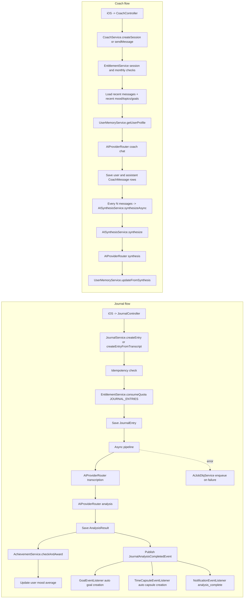
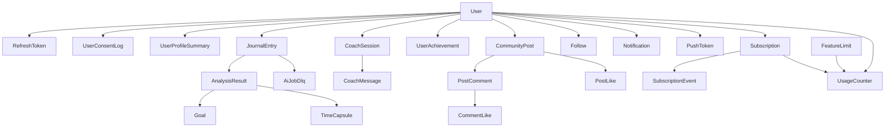

# Echo Backend Architecture Map

This document captures the big picture of the Echo Backend codebase in one place.
A single diagram covering every detail is impractical, but this map is enough to build a solid mental model of the system quickly.

The map reflects the current codebase and includes the premium membership layer.

## 1. Mega Runtime Map

```mermaid
flowchart TB
  IOS["iOS app"]
  Apple["Apple StoreKit 2<br/>signed transactions + notifications"]
  AI["AI providers<br/>OpenAI | Gemini | Claude"]
  StorageExt["Storage backend<br/>local disk or R2/S3"]
  Cache["Caffeine caches<br/>synthesis + entitlement + feature limits"]
  DB["PostgreSQL 16<br/>Flyway migrations"]

  IOS --> ApiEntry
  Apple --> SubscriptionApi

  subgraph Echo["Echo Backend - Spring Boot"]
    ApiEntry["Spring MVC entry"]
    ReqId["RequestIdFilter"]
    Jwt["JwtAuthenticationFilter"]
    Rate["RateLimitFilter"]
    SecurityGate["authenticated endpoints + method security"]

    ApiEntry --> ReqId --> Jwt --> Rate --> SecurityGate

    subgraph Controllers["Controller groups"]
      AuthApi["Auth and User APIs<br/>AuthController UserController PrivacyController AppConfigController"]
      JournalApi["Journal APIs<br/>JournalController CalendarController"]
      CoachApi["Coach API<br/>CoachController"]
      ReflectionApi["Reflection APIs<br/>SummaryController AIInsightsController"]
      CommunityApi["Community API<br/>CommunityController"]
      ProgressApi["Progress APIs<br/>GoalController TimeCapsuleController AchievementController NotificationController"]
      SubscriptionApi["Subscription API<br/>SubscriptionController"]
      AdminApi["Admin API<br/>AdminController"]
      HealthApi["Health API<br/>HealthController"]
    end

    SecurityGate --> AuthApi
    SecurityGate --> JournalApi
    SecurityGate --> CoachApi
    SecurityGate --> ReflectionApi
    SecurityGate --> CommunityApi
    SecurityGate --> ProgressApi
    SecurityGate --> SubscriptionApi
    SecurityGate --> AdminApi
    SecurityGate --> HealthApi

    subgraph Services["Core services"]
      AuthS["AuthService"]
      ConsentS["ConsentService"]
      UserStatsS["UserStatsService"]
      CalendarS["CalendarService"]
      JournalS["JournalService"]
      CoachS["CoachService"]
      SummaryS["SummaryService"]
      InsightsS["AIInsightsService"]
      CommunityS["CommunityService"]
      GoalS["GoalService"]
      CapsuleS["TimeCapsuleService"]
      AchievementS["AchievementService"]
      NotificationS["NotificationService"]
      SubscriptionS["SubscriptionService"]
      EntitlementS["EntitlementService"]
      AdminS["AdminService"]
      SynthesisS["AISynthesisService"]
      MemoryS["UserMemoryService"]
      StorageS["StorageService"]
      AppleKitS["AppleStoreKitService"]
      DlqS["AiJobDlqService"]
      EntryUpdater["JournalEntryUpdater"]
      Router["AIProviderRouter"]
    end

    AuthApi --> AuthS
    AuthApi --> ConsentS
    AuthApi --> UserStatsS
    JournalApi --> JournalS
    JournalApi --> CalendarS
    CoachApi --> CoachS
    ReflectionApi --> SummaryS
    ReflectionApi --> InsightsS
    CommunityApi --> CommunityS
    ProgressApi --> GoalS
    ProgressApi --> CapsuleS
    ProgressApi --> AchievementS
    ProgressApi --> NotificationS
    SubscriptionApi --> SubscriptionS
    SubscriptionApi --> EntitlementS
    AdminApi --> AdminS

    JournalS --> EntitlementS
    CoachS --> EntitlementS
    SummaryS --> EntitlementS
    InsightsS --> EntitlementS
    CapsuleS --> EntitlementS
    SubscriptionS --> EntitlementS

    JournalS --> Router
    CoachS --> Router
    SynthesisS --> Router
    AdminS --> Router
    DlqS --> Router
    Router --> AI

    CoachS --> MemoryS
    CoachS --> SynthesisS
    SummaryS --> SynthesisS
    InsightsS --> SynthesisS
    AchievementS --> SynthesisS
    SynthesisS --> MemoryS

    CommunityS --> StorageS
    SubscriptionS --> AppleKitS
    AppleKitS --> Apple
    StorageS --> StorageExt

    subgraph EventsAndJobs["Events, listeners, schedulers"]
      JournalEvent["JournalAnalysisCompletedEvent"]
      SocialEvents["AchievementEarnedEvent + community events"]
      GoalListener["GoalEventListener"]
      CapsuleListener["TimeCapsuleEventListener"]
      NotificationListener["NotificationEventListener"]
      JournalMaintenance["JournalMaintenanceService"]
      MemoryScheduler["MemoryUpdateScheduler"]
      MoodAlert["MoodAlertService"]
      CounterJob["CounterReconciliationJob"]
      ExpirySweep["SubscriptionService.processExpiredSubscriptions"]
    end

    JournalS --> EntryUpdater
    JournalS --> DlqS
    JournalS --> AchievementS
    JournalS --> JournalEvent
    AchievementS --> SocialEvents
    CommunityS --> SocialEvents

    JournalEvent --> GoalListener
    JournalEvent --> CapsuleListener
    JournalEvent --> NotificationListener
    SocialEvents --> NotificationListener
    GoalListener --> GrowthData
    CapsuleListener --> GrowthData
    NotificationListener --> NotificationS

    MemoryScheduler --> SynthesisS
    MemoryScheduler --> NotificationS
    MoodAlert --> NotificationS
    JournalMaintenance --> JournalData
    CounterJob --> SocialData
    ExpirySweep --> SubscriptionS

    subgraph Data["Persistent data domains"]
      IdentityData["Identity data<br/>users refresh_tokens user_profile_summaries consent_logs"]
      JournalData["Journal data<br/>journal_entries analysis_results ai_job_dlq"]
      CoachData["Coach data<br/>coach_sessions coach_messages"]
      SocialData["Community data<br/>community_posts comments likes follows"]
      GrowthData["Growth data<br/>goals time_capsules user_achievements notifications push_tokens"]
      SubscriptionData["Subscription data<br/>subscriptions feature_limits usage_counters subscription_events"]
    end

    AuthS --> IdentityData
    ConsentS --> IdentityData
    UserStatsS --> IdentityData
    UserStatsS --> JournalData
    CalendarS --> JournalData
    JournalS --> JournalData
    DlqS --> JournalData
    CoachS --> CoachData
    CoachS --> JournalData
    SummaryS --> JournalData
    InsightsS --> JournalData
    CommunityS --> SocialData
    GoalS --> GrowthData
    CapsuleS --> GrowthData
    AchievementS --> GrowthData
    NotificationS --> GrowthData
    SynthesisS --> IdentityData
    SynthesisS --> JournalData
    SynthesisS --> CoachData
    SubscriptionS --> SubscriptionData
    EntitlementS --> SubscriptionData

    IdentityData --> DB
    JournalData --> DB
    CoachData --> DB
    SocialData --> DB
    GrowthData --> DB
    SubscriptionData --> DB
  end

  EntitlementS --> Cache
  SynthesisS --> Cache
```

## 2. Journal and Coach Intelligence Flow

## 3. Domain and Data Map

## 4. Bounded Contexts

- Identity and access: `AuthService`, `SecurityConfig`, `JwtAuthenticationFilter`, `JwtTokenProvider`, `UserDetailsServiceImpl`
- Journal intelligence: `JournalService`, `JournalEntryUpdater`, `AIProviderRouter`, provider adapters under `com.echo.ai.*`
- Coach and memory: `CoachService`, `AISynthesisService`, `UserMemoryService`
- Reflection products: `SummaryService`, `AIInsightsService`, `CalendarService`, `UserStatsService`
- Growth loop: `AchievementService`, `GoalEventListener`, `TimeCapsuleEventListener`, `TimeCapsuleService`, `GoalService`
- Community: `CommunityService`, `StorageService`, social notification events
- Notifications: `NotificationService`, `NotificationEventListener`, push token registration, capsule unlock scheduler
- Subscription and monetization: `EntitlementService`, `SubscriptionService`, `AppleStoreKitService`, `SubscriptionController`
- Operations and resilience: `AiJobDlqService`, `JournalMaintenanceService`, `CounterReconciliationJob`, `MemoryUpdateScheduler`, `MoodAlertService`

## 5. What Is Actually Expensive or Risky

- AI cost centers: journal transcription, journal analysis, coach chat, synthesis
- Async behavior: journal processing, auto goal creation, auto capsule creation, synthesis
- Soft state and caching: synthesis cache plus entitlement caches can hide stale assumptions if not invalidated
- Quota logic: feature access is not only rate limiting; `EntitlementService` is the source of truth
- Event-driven side effects: one journal analysis can create goals, capsules, notifications, achievements, and mood aggregate updates
- Operational dependencies: local Postgres, Flyway migrations, provider API keys, optional local or S3 storage, Apple StoreKit config

## 6. Fast Reading Order

- `src/main/java/com/echo/config/SecurityConfig.java`
- `src/main/java/com/echo/service/AuthService.java`
- `src/main/java/com/echo/service/JournalService.java`
- `src/main/java/com/echo/service/CoachService.java`
- `src/main/java/com/echo/service/AISynthesisService.java`
- `src/main/java/com/echo/ai/AIProviderRouter.java`
- `src/main/java/com/echo/service/CommunityService.java`
- `src/main/java/com/echo/service/NotificationService.java`
- `src/main/java/com/echo/service/EntitlementService.java`
- `src/main/java/com/echo/service/SubscriptionService.java`
- `src/main/java/com/echo/event/GoalEventListener.java`
- `src/main/java/com/echo/event/TimeCapsuleEventListener.java`

## 7. Mental Model in One Paragraph

Echo is not just a CRUD backend. It is a journaling system where each journal entry can branch into an async AI pipeline, generate structured analysis, trigger achievements and growth artifacts, feed coach context, update long-term memory, and now pass through subscription-based entitlement gates. The project is easiest to reason about if you think in five layers: HTTP and security, feature services, shared intelligence services, event and scheduler automation, and finally bounded data domains in Postgres.
